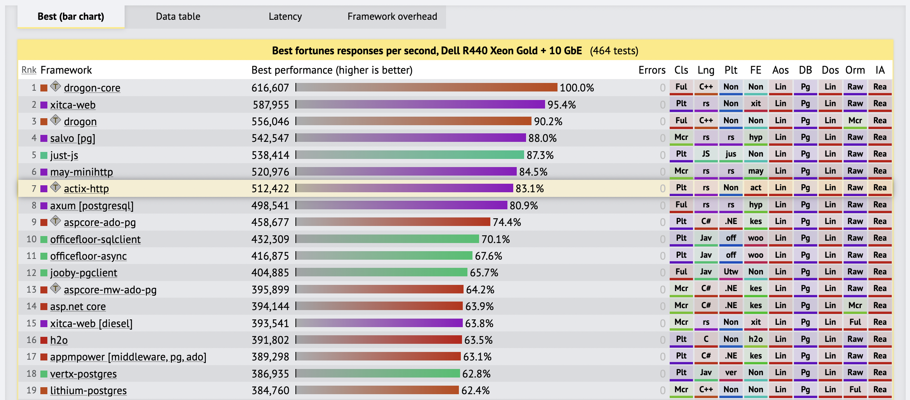
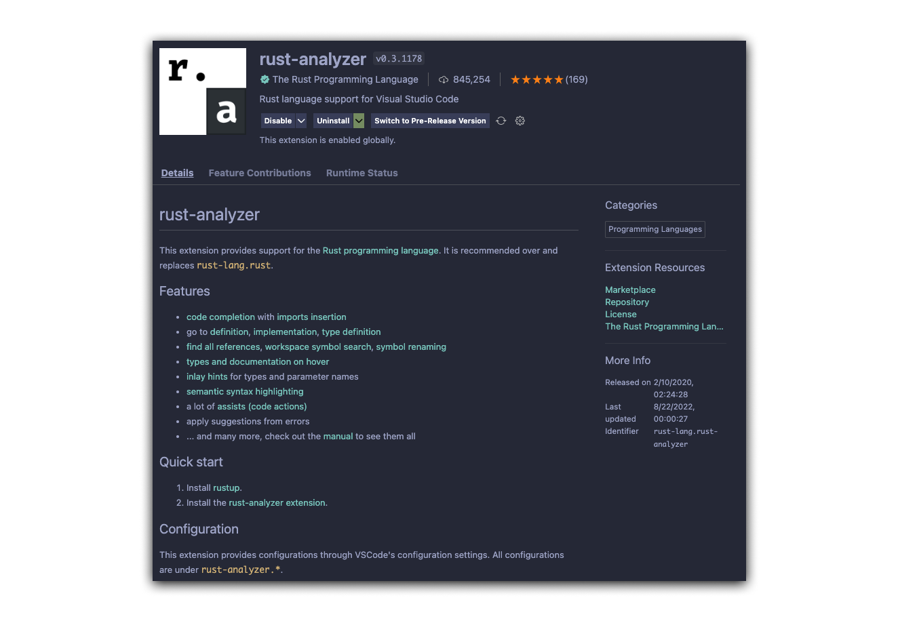
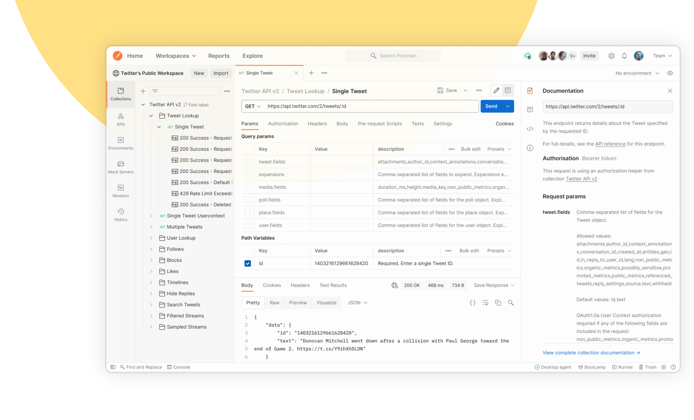

# Rust API + Actix Web

Rust is the best programming language out there. It is the most loved programming language for 7 years in a row now ([2016](https://insights.stackoverflow.com/survey/2016#technology-most-loved-dreaded-and-wanted), [2017](https://insights.stackoverflow.com/survey/2017#most-loved-dreaded-and-wanted), [2018](https://insights.stackoverflow.com/survey/2018#technology-_-most-loved-dreaded-and-wanted-languages), [2019](https://insights.stackoverflow.com/survey/2019#technology-_-most-loved-dreaded-and-wanted-languages), [2020](https://insights.stackoverflow.com/survey/2020#most-loved-dreaded-and-wanted), [2021](https://insights.stackoverflow.com/survey/2021/#technology-most-loved-dreaded-and-wanted) and [2022](https://survey.stackoverflow.co/2022/#section-most-loved-dreaded-and-wanted-programming-scripting-and-markup-languages)) and there is a reason why. It is a strongly typed, compiled, no manual memory deallocation, non-garbage collected, ultra-reliable, and blazingly fast language. All of these things and more make Rust the best choice when it comes to writing software. Here's a list of companies that are using Rust in production.

|Company|Example|
|-|-|
|Discord|<https://discord.com/blog/why-discord-is-switching-from-go-to-rust>|
|Meta|<https://engineering.fb.com/2022/07/27/developer-tools/programming-languages-endorsed-for-server-side-use-at-meta>|
|Amazon|<https://www.amazon.science/blog/how-prime-video-updates-its-app-for-more-than-8-000-device-types>|
|Figma|<https://www.figma.com/blog/rust-in-production-at-figma/>|
|npm|<https://www.rust-lang.org/static/pdfs/Rust-npm-Whitepaper.pdf>|
|Cloudflare|<https://blog.cloudflare.com/building-cloudflare-images-in-rust-and-cloudflare-workers/>|
|Other examples|<https://www.rust-lang.org/production/users>|

[Actix Web](https://actix.rs/) is a Rust framework that allows you to build web APIs. It is one of the [fastest frameworks](https://www.techempower.com/benchmarks/#section=data-r21&hw=ph&test=fortune) out there only being beat by C++ Drogon. It's intuitive and easy to build programs with.



## The Rust Book & Documentation

---

The best place to start and learn more about the Rust Programming Language is [the Rust Book](https://doc.rust-lang.org/book/).

|Program|Documentation|
|-|-|
|Rust|<https://doc.rust-lang.org/book/>|
|Actix|<https://actix.rs/docs/getting-started/>|
|AWS Rust SDK|<https://docs.aws.amazon.com/sdk-for-rust/latest/dg/welcome.html>|
|Supabase Postgrest|<https://github.com/supabase-community/postgrest-rs>|
|Stripe Rust API|<https://github.com/arlyon/async-stripe>|

## Getting Started

---

To get started, install Rust on your machine. [https://www.rust-lang.org/learn/get-started](https://www.rust-lang.org/learn/get-started)

```bash
curl --proto '=https' --tlsv1.2 -sSf https://sh.rustup.rs | sh
```

After installing, make sure to install local IDE tools to get types, autocomplete, automatic installation of crates, and more. Here is the one for [VS Code](https://marketplace.visualstudio.com/items?itemName=rust-lang.rust-analyzer).



You will then need to copy `.env.example` to `.env` with this command

```Bash
cp .env.example .env
```

or with the make command

```Bash
make env
```

Update your `.env` credentials.

## Running and Testing

---

To run on your machine, make sure you are in the root directory of this project and run the following command

```bash
cargo run
```

To enable hot reloading, download [the following crate](https://crates.io/crates/cargo-watch) called `cargo watch` with the following command

```bash
cargo install cargo-watch
```

Then run the following command to enable hot reloading

```bash
cargo watch -x run
```

or with the make command

```Bash
make local
```

Use [Postman](https://www.postman.com/) or [Insomnia](https://insomnia.rest/) to test manually locally. You can add a URL such as <http://localhost:8080/checkout> into the application of your choice, specify params, headers, body, the request method, and more.



This Rust API is dependent on a couple of different services. It uses Stripe to process payments, Supabase as the database, and AWS DynamoDB for a high-performance cache.

Download the database from the repo with the following command

```Bash
git clone https://github.com/leftovers-marketplace/database.git
```

Follow the documentation in the `database` repository to spin up the database.

Copy the `API URL` from when you start the database into the Rust API SUPABASE_URL .env variable and the `service_role key` into the SAPABASE_SERVICE_KEY .env variable.

## Testing Stripe Locally

---

To start testing [Stripe Webhooks](https://stripe.com/docs/webhooks), download the Stripe SDK

```Bash
brew install stripe
```

Then log into Stripe

```Bash
stripe login
```

Then start the Stripe listener and it will stream events that occur

```Bash
stripe listen --forward-to localhost:8080/stripe/webhook
```

`Open a new terminal` and trigger the webhook you want such as

```Bash
stripe trigger payment_intent.succeeded
```

## Unit Testing

---

Unit testing goes a long way to be able to ship reliable code. Actix [has documentation](https://actix.rs/docs/testing/) on how to write unit tests. PLEASE MAKE SURE TO WRITE UNIT TESTS. There is nothing worse than crashing prod.

```Rust
#[cfg(test)]
mod tests {
    use super::*;
    use actix_web::{
        http::{self, header::ContentType},
        test,
    };

    #[actix_web::test]
    async fn test_index_ok() {
        let req = test::TestRequest::default()
            .insert_header(ContentType::plaintext())
            .to_http_request();
        let resp = index(req).await;
        assert_eq!(resp.status(), http::StatusCode::OK);
    }

    #[actix_web::test]
    async fn test_index_not_ok() {
        let req = test::TestRequest::default().to_http_request();
        let resp = index(req).await;
        assert_eq!(resp.status(), http::StatusCode::BAD_REQUEST);
    }
}
```

## Releasing To Production

---

Rust is a compiled language meaning it doesn't require any runtime and ships as a single binary. This comes with a lot of benefits over interpreted languages.

To compile to a production binary, run the following command

```Bash
cargo build --release
```

This command will optimize the build and make sure that it is as fast as possible.

To run the binary, navigate to the binary which is located in the `/target/release/` directory. The binary is named whatever your project name is specified in your Cargo.toml file. You then just run the binary in the terminal such as `./your-binary-name`.
